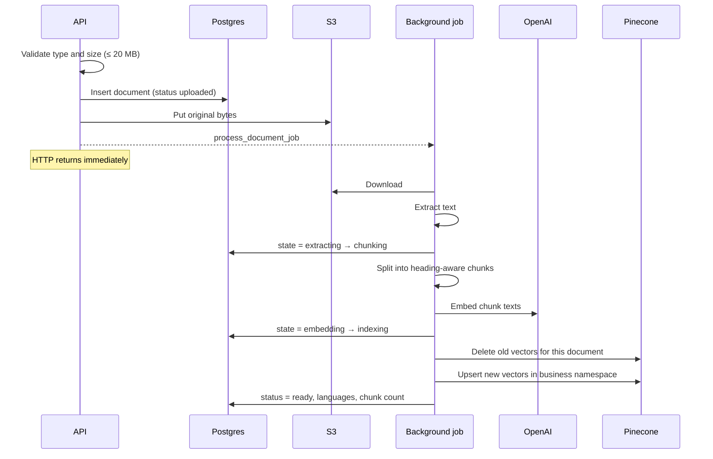
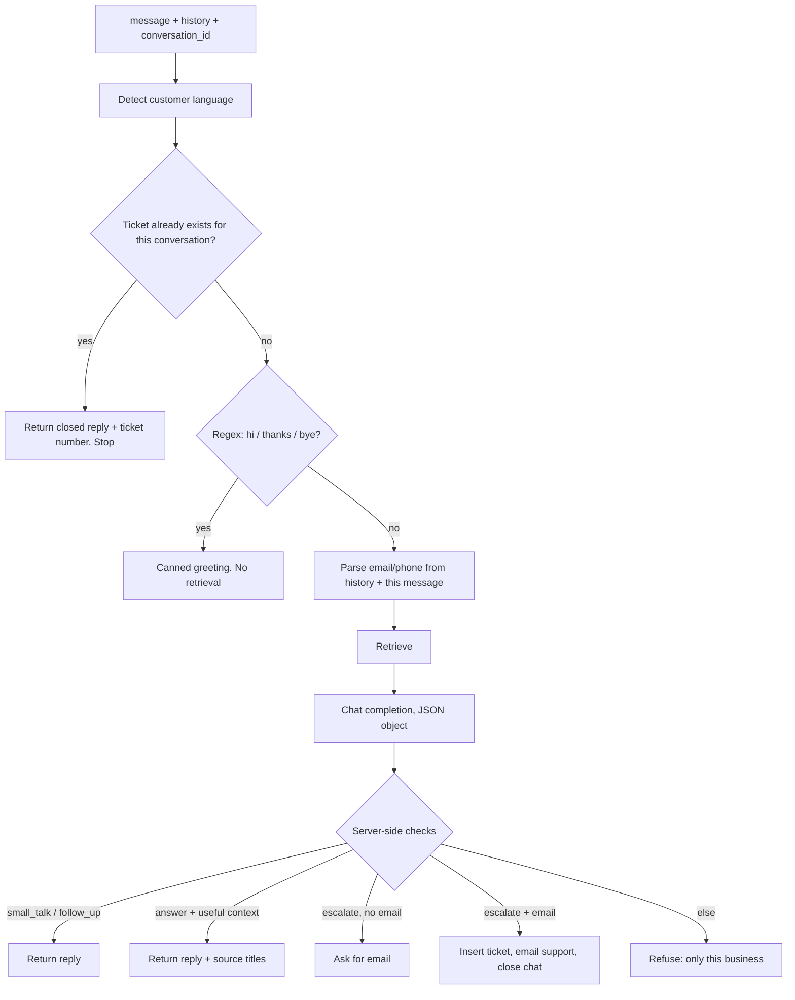

# How the backend works

Support Dock’s API is a FastAPI app. Every important path is: **accept a request → load the right business → do work in services → talk to Postgres, S3, Pinecone, OpenAI, or Resend**.

There are two public surfaces:

- Authenticated routes under `/api/v1/…` — JWT required, scoped to businesses the user owns.
- Widget chat at `/api/v1/widget/{business_id}/chat` — no JWT. The browser `Origin` must match that business’s saved website origin.

Both chat routes call the same function: `answer_question`.

---

## 1. A request hits the API

`create_app()` mounts CORS, then the v1 router.

```
Request
  → OriginAwareCORSMiddleware
  → route + dependencies (DB session, auth or widget origin)
  → endpoint
  → service
```

**CORS is path-aware.** Dashboard origins from `CORS_ORIGINS` are allowed on the whole API. Widget chat is different: the middleware extracts `business_id` from `/api/v1/widget/{id}/chat`, loads that business, and only reflects `Access-Control-Allow-Origin` if the request origin equals `business.website_origin`. Anything else gets a failed preflight.

On startup the app creates tables if needed and runs a few `ALTER TABLE … IF NOT EXISTS` statements so older databases pick up new columns.

---

## 2. Auth

`POST /api/v1/auth/register` and `/login` hash passwords with bcrypt and return a JWT (`sub` = user id). Protected routes use `HTTPBearer` → `decode_access_token` → load the user.

Business-scoped routes don’t just take a UUID from the URL. They go through `get_owned_business`: load the business **where `id` matches and `owner_id` is the current user**. Wrong owner looks like a 404, not a 403, so you can’t probe other tenants.

The widget does not use this. It uses `get_widget_business`: load by id, then require `Origin` to match `website_origin`. Mismatch is 403.

A website origin is unique across all businesses. Saving a URL stores both the full URL and `scheme://host` so CORS and the widget check compare origins, not paths.

---

## 3. Document flow: file → searchable chunks

`POST /api/v1/businesses/{id}/documents` is the start of indexing.



### Upload

1. Reject unsupported extensions and empty/oversized files.
2. Insert a `documents` row (filename, title, content type, size). `s3_key` is filled after the object lands.
3. Write the object to `businesses/{business_id}/documents/{document_id}/{random}_{filename}`.
4. Queue `process_document_job` on FastAPI `BackgroundTasks`. The client gets the document record while status is still `uploaded` / `queued`.

If S3 fails, the row is deleted so you don’t leave a document with no file.

### Processing (`process_document`)

The job opens its own DB session and walks explicit states so a poller can see where it is.

| State | What happens |
| --- | --- |
| extracting | Download from S3. Parse PDF / DOCX / HTML / plain text. Strip nav, scripts, page numbers, repeated headers. |
| chunking | Split on markdown headings, FAQ Q/A, numbered steps. Pack ~300–500 words with ~65-word overlap. Prefix each chunk with document title and section path. Detect language per chunk. |
| embedding | Batch texts through OpenAI (`text-embedding-3-small`, 512 dims). |
| indexing | Delete any previous vectors for this `document_id`. Upsert into Pinecone **namespace = business UUID**. Vector id is `{document_id}:{chunk_order}`. Metadata: `business_id`, `document_id`, title, heading, language, chunk text (capped). |
| ready | Store chunk count, majority language, and the set of chunk languages. Those languages roll up onto the business as `knowledge_languages`. |

Any stage can fail (`extraction_failed`, `embedding_failed`, `indexing_failed`, …). The row stays; the owner can reindex.

### Replace, reindex, delete

- **Replace** uploads a new object, purges old S3 + vectors, then runs the same job.
- **Reindex** re-runs the job on the existing S3 object (useful after a failed index).
- **Delete** removes vectors and the S3 object, then deletes leftover vectors in that namespace whose `document_id` is no longer in Postgres.

Deleting a **business** wipes the S3 prefix `businesses/{id}/` and `delete_all` on that Pinecone namespace.

---

## 4. Chat flow: question → retrieve → JSON decision → reply or ticket

Two entry points, one pipeline:

| Route | Gate |
| --- | --- |
| `POST /api/v1/businesses/{id}/chat` | JWT + owner |
| `POST /api/v1/widget/{id}/chat` | `Origin` == `website_origin` |

Body: `message`, optional `history` (last turns), optional `conversation_id`.

Then `answer_question`:



History is **not** treated as a knowledge source. It is only used for: continuing a conversation id, extracting contact details, and giving the model prior turns so follow-ups make sense.

### Retrieval

1. Collect ids of documents with `status = ready`. If none, retrieval is empty.
2. Search text is the current message, or `previous user message + current` so short follow-ups (“what about refunds?”) still retrieve.
3. Embed that query. Query Pinecone in **this business’s namespace only**, `top_k = 8`, metadata filter `{ business_id, document_id ∈ live ids }`.
4. Drop hits below `chat_min_score`, wrong `business_id`, unknown `document_id`, or empty text.
5. If the best remaining score is below `chat_strong_score`, **or** the customer’s language is not in `knowledge_languages`, translate the query into each knowledge language and search again.
6. Merge by vector id (keep the higher score), take the top 6.

So a question in Arabic against English docs can still hit: detect `ar` → weak/mismatch → translate query to English → search → same chunks.

### Generation

`_complete` builds a system prompt that:

- Names the business
- Forces the reply language to the detected customer language
- Allows greetings, answers from excerpts + business profile only, one follow-up, and escalation when a human must act
- Forbids world knowledge, invented policies/prices/contact details, and using earlier turns as facts
- Attaches owner `assistant_instructions` as extra tone/rules that **cannot** invent facts or override the constraints

The user message to the model is: business profile + numbered excerpts (or “none”) + the latest customer text. `response_format` is JSON.

The model must return:

```json
{
  "type": "small_talk | answer | follow_up | escalate | refuse",
  "reply": "…",
  "ticket": { "title", "summary", "category", "priority", "internal_reason" }
}
```

`ticket` is only used when `type` is `escalate`.

### Server-side enforcement

The API does not trust `type` blindly:

- `answer` is accepted only if retrieval returned chunks, **or** the user asked for contact/about info and the business profile has something to say. Otherwise it becomes a refuse.
- If the last assistant message asked for an email and this message contains one, kind is forced to `escalate` even if the model said something else.
- `escalate` without a customer email does not open a ticket; it asks for an email (and optional phone). Business `contact_email` / `support_email` / `contact_phone` are stripped out of the parsed contact fields so the company inbox cannot be treated as the customer.
- Anything else (empty reply, `refuse`, answer with no context) returns the refuse template.

---

## 5. Ticket flow

`_open_ticket` runs only after the checks above.

1. Re-check uniqueness: one ticket per `(business_id, conversation_id)`.
2. Insert into `tickets`: generated `T-XXXXXXXX` number, title/summary/category/priority from the model (validated against allowed enums), transcript JSON, customer email/phone/language, `internal_reason` (never shown on the widget).
3. If Resend is configured and the business has `support_email`, send HTML mail (ticket number, priority, category, customer links, summary, reason, transcript). Status on the row: `sent`, `skipped`, or `failed`.
4. Append the ticket number onto the customer-facing reply and set `chat_closed: true`.

The next message with that `conversation_id` hits the early exit in step 4 and only repeats “this conversation is closed.”

Listing tickets is owner-only: `GET /api/v1/businesses/{id}/tickets`.

---

## 6. Isolation, end to end

A question for business A cannot read business B’s knowledge even if someone guesses B’s UUID on the widget: CORS and the origin dependency both require B’s website. The dashboard cannot load B’s documents without B’s owner JWT.

Vectors are isolated twice: **namespace = business id**, and every query/upsert carries `business_id` (and live `document_id`s) in metadata filters. Chunk text lives in Pinecone metadata so retrieval does not need a second hop to Postgres for the passage.

Original files never go to the model as binaries. Only extracted, chunked text is embedded and later injected as excerpts.
