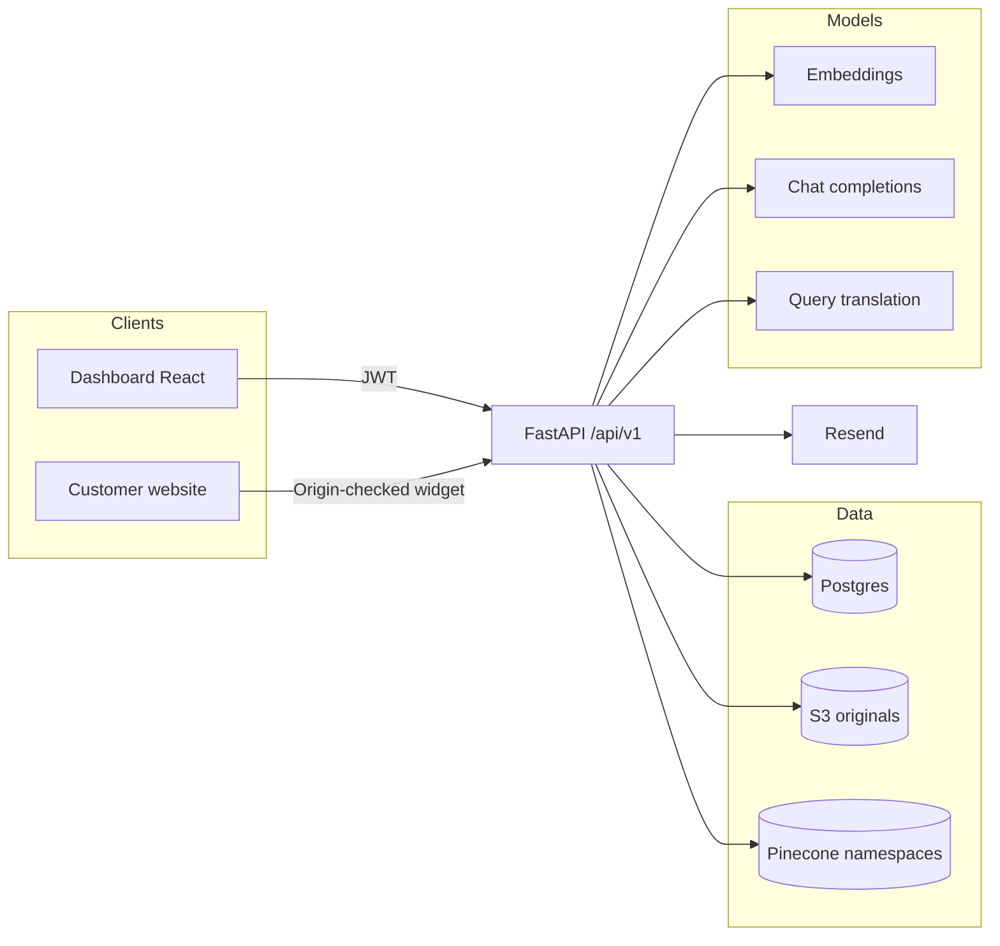
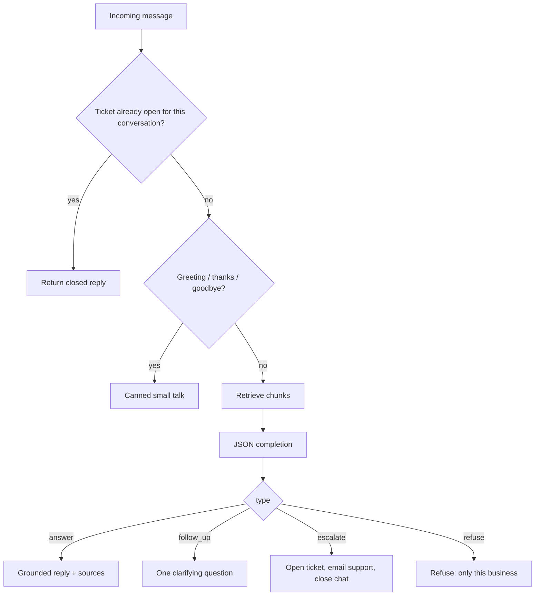

# Support Dock

A multi-tenant AI support platform. Businesses upload help docs, get a grounded assistant that only answers from those docs, embed it on their own website, and receive a ticket when a human needs to take over.

This repo is a full-stack portfolio project: React dashboard, FastAPI backend, Postgres, S3, Pinecone, and OpenAI.

## What it does

An owner signs up, creates a **business workspace**, and uploads PDFs, Word, Markdown, HTML, or text. Those files are extracted, chunked, embedded, and indexed. Customers (or the owner, in a test chat) ask questions. The assistant retrieves relevant passages, answers only from that context plus a short business profile, and refuses everything else.

If the issue needs a person — payments, bugs, refunds, account access, an explicit ask for a human — the assistant collects the customer’s email, opens a ticket, emails the support inbox, and closes that conversation.

The public chat is **origin-locked**. Each business stores one website origin. The widget endpoint accepts requests only from that origin, and that origin cannot talk to another business.

## Architecture



| Layer | Role |
| --- | --- |
| `web/` | Create React App dashboard: auth, workspaces, documents, tickets, assistant instructions, test chat, embed snippet |
| `api/` | FastAPI app: auth, businesses, document pipeline, RAG chat, widget, tickets |
| Postgres | Users, businesses, document metadata, tickets |
| S3 | Private original files; downloads use short-lived presigned URLs |
| Pinecone | One serverless index; **one namespace per business** |
| OpenAI | Embeddings, grounded JSON answers, optional query translation |
| Resend | Ticket email to the business support address |

## How a document becomes searchable

Upload is authenticated and scoped to a business the current user owns. Max size is 20 MB. Supported types: `.pdf`, `.docx`, `.md`, `.html`, `.txt`.

1. **Store.** The raw file is written to S3 under `businesses/{business_id}/documents/{document_id}/…`. Postgres stores filename, status, and processing state.
2. **Extract.** Text is pulled from PDF, Word, HTML, or plain files. HTML drops nav/script/style; PDFs drop running headers and page numbers.
3. **Chunk.** The text is split on headings, FAQ pairs, and numbered steps, then packed into overlapping ~300–500 word chunks. Each chunk is prefixed with document title and section path so retrieval keeps that context.
4. **Language.** Each chunk is language-detected. The document records a majority language plus the set of languages present. Those roll up to the business as `knowledge_languages`.
5. **Embed.** Chunks go through OpenAI embeddings (`text-embedding-3-small`, 512 dimensions).
6. **Index.** Vectors are upserted into the business’s Pinecone namespace. Metadata includes `business_id`, `document_id`, title, heading path, language, and the chunk text.

Processing runs as a FastAPI background task with explicit states: queued → extracting → chunking → embedding → indexing → ready (or failed with a code). Replace and reindex delete old vectors first. Delete also purges S3 and leftover vectors for that document.

## How a question is answered

Dashboard chat and the public widget share the same `answer_question` path. The difference is **who is allowed to call it**.



**Retrieval**

- Only documents with status `ready` are searchable.
- The query is embedded and searched in that business’s namespace, with a metadata filter on `business_id` and live `document_id`s.
- Hits below a minimum cosine score are dropped. Weak top scores, or a language mismatch between the customer and the knowledge base, trigger **query translation** into the document languages and a second search. Results are merged and de-duplicated.

**Generation**

The model returns a JSON object (`small_talk` | `answer` | `follow_up` | `escalate` | `refuse`). The system prompt is strict:

- Answer only from retrieved excerpts and the business profile (name, description, public email, phone, website).
- Reply in the customer’s detected language.
- Do not use world knowledge, invent policies, or treat chat history as a source of facts.
- Owner-written assistant instructions can set tone and escalation preference; they cannot invent facts or override those rules.

If the model says `answer` but there were no useful excerpts (and the question is not a contact/profile question), the API refuses. Sources returned to the dashboard are document title plus heading, not raw chunk text.

## Widget isolation

The embed is a `fetch` to:

`POST /api/v1/widget/{business_id}/chat`

There is no widget API key. Two checks have to agree:

1. **CORS middleware** allows dashboard origins on the whole API. For widget chat, it allows only that business’s saved `website_origin`.
2. **Route dependency** reads the `Origin` header again and 403s unless it matches. One website origin is unique across businesses.

Browsers set `Origin` and pages cannot override it from JavaScript, which is the intended threat model: a snippet copied onto site A cannot be reused on site B, and site A cannot query another tenant’s knowledge base.

The authenticated dashboard chat is a separate route (`/businesses/{id}/chat`) and requires a JWT for the owner.

## Tickets and escalation

Escalation is for actions a document cannot complete (payment failure, bugs, refunds, access, security, “talk to a person”). The assistant must already have a **customer email** from the thread; phone is optional. Business contact details are ignored so the model cannot treat the company inbox as the customer.

Opening a ticket:

- Stores title, summary, category, priority, internal reason, transcript, and contact info
- Assigns a `T-XXXXXXXX` number
- Enforces one ticket per `(business_id, conversation_id)`
- Emails the business `support_email` via Resend when mail is configured
- Sets `chat_closed` so further messages in that conversation only return the ticket number

Owners inspect tickets in the dashboard. The widget never sees internal reason or the support inbox.

## Data model (Postgres)

```
User 1──* Business 1──* Document
                 └──* Ticket
```

- **User** — email, bcrypt password hash
- **Business** — profile, public contact details, support inbox, website URL + origin, optional assistant instructions, knowledge languages
- **Document** — file metadata, S3 key, processing status, chunk count, languages
- **Ticket** — conversation id, customer contact, transcript JSON, email send status

Dashboard sessions are JWTs (HS256) in `localStorage`. Protected routes call `/auth/me` on load.

## Isolation and security (design)

| Concern | Approach |
| --- | --- |
| Tenant data | Owner-scoped queries for dashboard routes; widget is origin-scoped |
| Vector leak across tenants | Pinecone namespace = business id, plus metadata filters on `business_id` and live document ids |
| Original files | Private S3 objects; short-lived presigned GET for the owner |
| Public chat abuse | Origin allowlist, no widget secret, conversation closes after a ticket |
| Grounding | Refuse when retrieval is empty; JSON contract; no general-knowledge answers |
| Secrets | Loaded from environment / `api/.env`; that file is gitignored |

Copy `api/.env.example` locally. Never commit real keys, database URLs, or JWT secrets.

## Repository layout

```
api/
  app/
    api/v1/endpoints/   auth, businesses, documents, chat, widget, tickets
    core/               settings, JWT, origin-aware CORS
    models/             SQLAlchemy
    schemas/            Pydantic
    services/           extraction, chunking, embeddings, Pinecone, RAG, mail
  .env.example
web/
  src/
    pages/              dashboard, workspace tabs
    workspace/          business context, connect/embed dialog
    api/                HTTP client
```

## Local development

You need Python 3.9+, Node, a Postgres database (for example Neon), an S3 bucket, a Pinecone project, and an OpenAI key. Resend is optional until you want ticket email.

```bash
# API
cd api
python -m venv .venv
source .venv/bin/activate
pip install -r requirements.txt
cp .env.example .env   # fill in your own values
uvicorn app.main:app --reload --port 8000

# Dashboard (another terminal)
cd web
npm install
npm start              # http://localhost:3000, proxies to :8000
```

`GET /health` should return `{"status":"ok"}`.

## Status

Personal project built to demonstrate RAG, multi-tenant isolation, a document indexing pipeline, and an origin-locked public chat surface. Not a hosted product.
# support-dock
